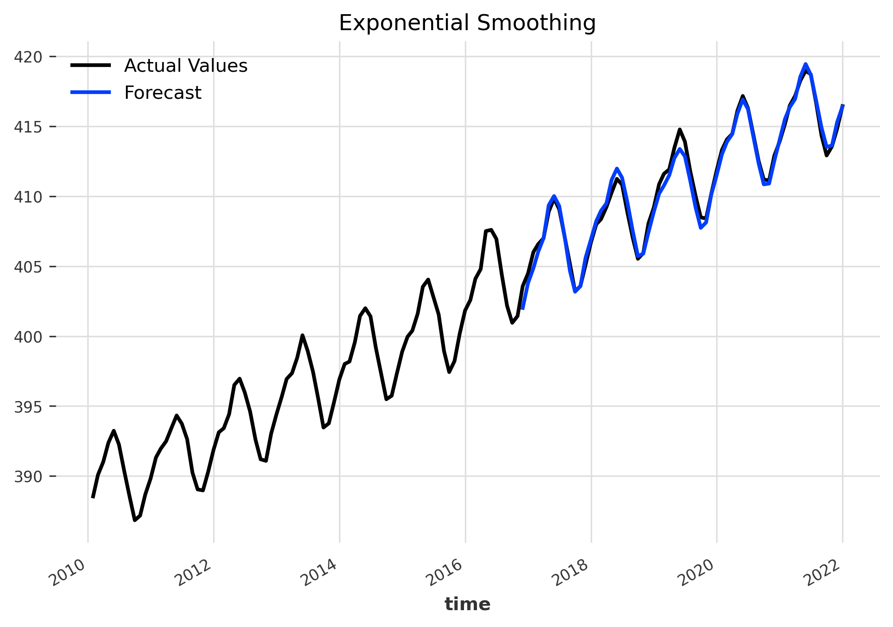

# Atmospheric CO2 Concentration Forecasting
In this project, I am comparing the performance of various forecasting models, including classical, machine learning and deep learning approaches, by using the [darts library](https://unit8co.github.io/darts/index.html) . My goal is to create a forecast for the atmospheric CO2 concentration of 2022, based on the the Mauna Loa CO2 dataset. Furthermore, I am also applying time series analysis to understand the statistical properties of the data.

### Towards Data Science Article:
[Forecasting Atmospheric CO2 with Python](https://towardsdatascience.com/forecasting-atmospheric-co2-concentration-with-python-c4a99e4cf142)